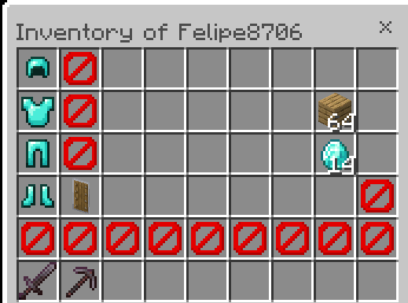

# InvSee Plugin

Invsee is a BDSX Plugin that allows you to view other players inventory

---

## Features
- See inventory of players

- realtime update

- Enderchest Support

- Multi-language Plugin

## Configuring

The plugin provides a simple configuration for changing it's language (now it only has support for english & spanish)
the file name if configuration.json, is located in the plugin root directory.

### Credits

This plugin uses [ContainerMenu](https://github.com/Se7en-dev/ContainerMenu) Library created by Se7en-dev

Thanks for using my plugin :D
